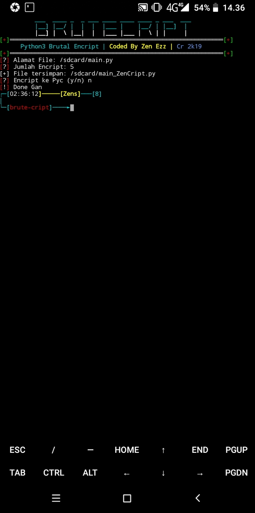

## Installing
```
$ pkg install git
$ pkg install python3
$ python -m pip install uncompyle6
$ git clone https://github.com/Zen-Clay/brute-cript
$ cd brute-cript
$ python3 brute-cript.py
```
```
count maksimal 50
```



## Ask Me On
* [YouTube](https://www.youtube.com/channel/UCopf7XF5D5hVyx2TePHl-pw)
* [Facebook](https://www.facebook.com/fatahul.ulum.1)
* [Instagram](https://www.instagram.com/aditiastrom)
